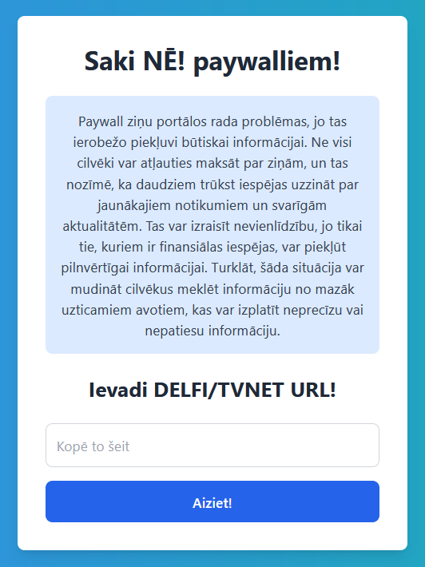

# Say NO! to DELFI+ and TVNET+ paywalls!

This project is a Flask-based web application that allows users to retrieve and display paywall-protected articles from **TVNET** and **DELFI** websites. The application extracts and formats the articles' content, including titles, leads, and body text, for a consistent and pleasant reading experience. It also features SQLite caching to reduce redundant API calls and improve performance.

## Features

### 1. Article Retrieval
- **TVNET Articles**: The application extracts articles from TVNET by scraping the website's HTML content. It processes the article's title, lead, and body content, and formats them for display.
- **DELFI Articles**: The application fetches articles from DELFI using their GraphQL API. It processes the article's content, including titles, leads, and paragraphs, and formats them appropriately.

### 2. Content Caching
- Articles retrieved from TVNET and DELFI are cached in an SQLite database. This reduces the need to repeatedly fetch the same article from the source, enhancing performance.
- The cache stores information such as the article's source, title, lead, text content, metadata (like image URL), and the full URL.

### 3. URL Extraction and Processing
- **TVNET**: Extracts the article ID from a given TVNET URL using regex. The application then scrapes the article content based on this ID.
- **DELFI**: Extracts the article ID directly from the URL using regex patterns. The ID is used to make a request to the DELFI API to retrieve article content.

### 4. Environment Variables
- The application uses environment variables (loaded via a `.env` file) to manage sensitive information and configuration, such as API tokens, request headers, and error messages.
    - **DELFI_TOKEN**: Authorization token for accessing the DELFI API.
    - **DELFI_HASH**: Hash required for the DELFI API request.
    - **TVNET_COOKIE**: Cookie used in the headers for TVNET requests.
    - **USER_AGENT**: User-Agent string used in requests to both TVNET and DELFI.
    - **SECRET_KEY**: Flask secret key used for session management.
    - **ERROR_MSG**: Custom error message displayed when an issue occurs.
    - **INFO_TEXT**: Informational text displayed on the main page.

### 5. Error Handling and User Feedback
- The application includes robust error handling to manage issues like network errors or missing data. Users are informed of any errors through flash messages displayed on the interface.

### 6. Database Setup and Management
- The SQLite database (`articles.db`) is initialized on the application's first run. The database includes a table for storing cached articles.
    - **Table Structure**:
        - `source`: The source of the article (e.g., "tvnet", "delfi").
        - `article_id`: Unique ID of the article.
        - `title`: The title of the article.
        - `lead`: The lead or introductory text of the article.
        - `text_content`: The main content of the article, formatted for display.
        - `meta_image_url`: URL of the article's meta image.
        - `full_url`: Original URL of the article.
        - `timestamp`: Timestamp of when the article was cached.

## Usage

1. **Running the Application**:
    - Ensure that the environment variables are properly set in a `.env` file.
    - Initialize the database by running the Flask application (`app.py`).
    - Access the application through `http://localhost:5000/`.

2. **Accessing Articles**:
    - Enter a URL from TVNET or DELFI in the provided input field on the homepage.
    - The application will retrieve and display the article. If the article has been cached, it will be retrieved from the local cache.

## Requirements

- Python 3.x
- Flask
- requests
- BeautifulSoup4
- SQLite3
- python-dotenv

## Setup

1. Clone the repository.
2. Install dependencies:
    ```bash
    pip install -r requirements.txt
    ```
3. Create a `.env` file in the root directory with the following variables:
    ```plaintext
    DELFI_TOKEN=your_delfi_token
    DELFI_HASH=your_delfi_hash
    TVNET_COOKIE=your_tvnet_cookie
    USER_AGENT=your_user_agent
    SECRET_KEY=your_secret_key
    ERROR_MSG="Your custom error message"
    INFO_TEXT="Your informational text"
    ```
4. Run the application:
    ```bash
    python app.py
    ```

## Screenshots




## License

This project is licensed under the MIT License.
